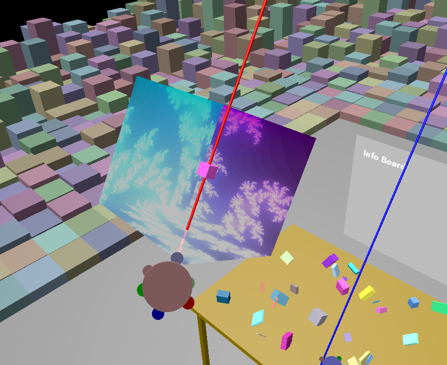
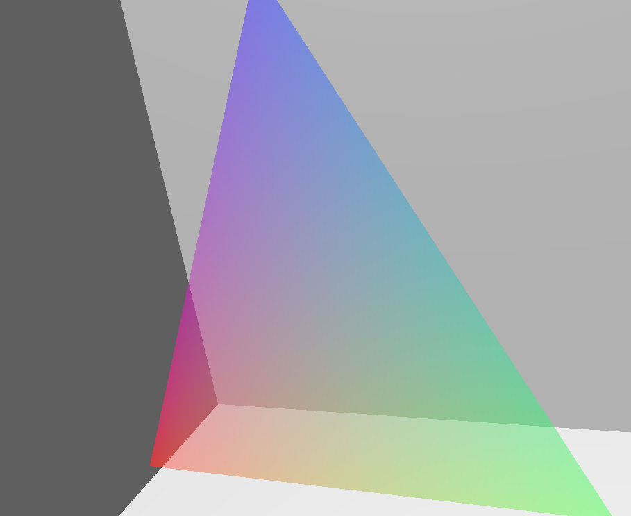
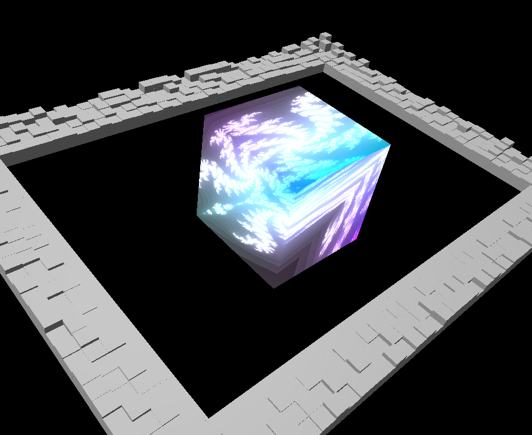
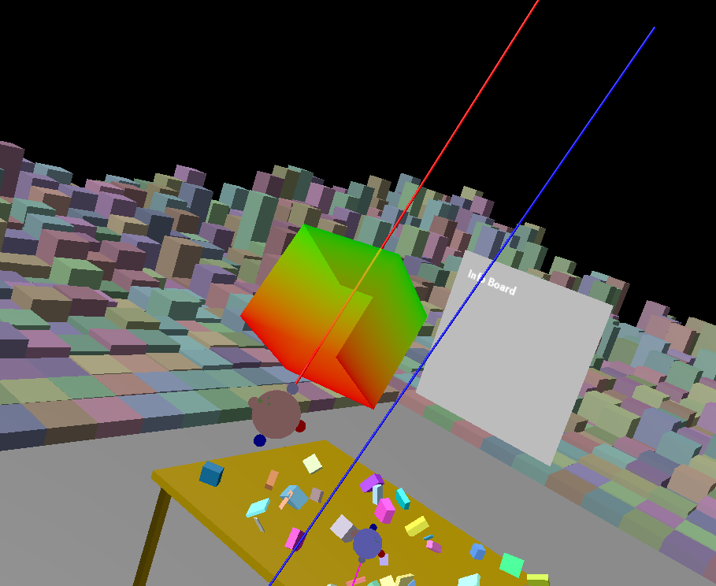

    
    idea:
        a collection of widgets will be imp. here 
    technique stack:
    done:
    tobetested:
        a colorful box 
    todo: 
        color picker 
        gui panel 
    change log: 
        26/08/2020
    current sreenshots:

